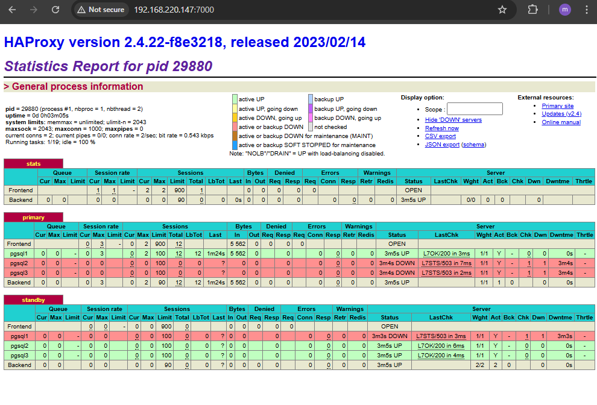

# Patroni Cluster Lab

A **High-Availability PostgreSQL cluster** setup using [Patroni](https://patroni.readthedocs.io/) and [etcd](https://etcd.io/).  
This repository is a lab environment to demonstrate how to run a PostgreSQL cluster with automatic failover, leader election, and service discovery using Patroni + etcd.

---

## 🚀 Features
- PostgreSQL cluster with automatic leader election & failover
- etcd as Distributed Consensus Store (DCS)
- Systemd unit files for `etcd` and `patroni`
- Example configuration for a **3-node etcd cluster** + **3-node Patroni cluster**
- HAProxy as a load balancer and single entry point
- Ready-to-use lab environment (VMs, manual deployment)

---

## 🏗️ Architecture
       +-----------------------------+
     |        etcd Cluster         |
     |  192.168.220.140 (etcd1)    |
     |  192.168.220.141 (etcd2)    |
     |  192.168.220.142 (etcd3)    |
     +-------------+---------------+
                   |
                   v
     +-----------------------------+
     |       Patroni Cluster       |
     |  192.168.220.143 (pg1)      |
     |  192.168.220.144 (pg2)      |
     |  192.168.220.145 (pg3)      |
     +-------------+---------------+
                   |
                   v
     +-----------------------------+
     |         HAProxy             |
     |   192.168.220.147 (haproxy) |
     +-------------+---------------+
                   |
                   v
     +-----------------------------+
     |       PostgreSQL HA DB      |
     |   Leader + 2 Followers      |
     +-----------------------------+

## 📊 HAProxy Dashboard

Patroni + HAProxy provides a web dashboard to monitor node health and routing status.  
Accessible on port `7000`:

- **etcd cluster** is used as DCS to store cluster state, leader key, and configuration.
- **Patroni cluster** connects to etcd for consensus and manages PostgreSQL failover.
- **PostgreSQL nodes** are managed by Patroni, ensuring only one leader at a time.

---

## 📂 Repository Structure

- `patroni-cluster-lab/`
  - `etcd/`
    - `etcd.conf` – etcd cluster config
  - `patroni/`
    - `patroni.yml` – Patroni cluster config
  - `docs/`
    - `setup-guide.md` – step-by-step installation
  - `README.md` – this file

---

## ⚙️ Requirements
- Linux (tested on Rocky 9.6)
- Python ≥ 3.9
- PostgreSQL ≥ 13 (tested up to v17)
- etcd ≥ 3.6
- Patroni ≥ 4.0
- HAProxy version 2.4.22

---

## 📝 Best Practices & Recommendations

- This cluster relies on the **Raft consensus algorithm**.  
  To maintain availability, at least `n/2 + 1` nodes must remain online.  

- Running the cluster (and in general all **stateful database services**) is highly recommended on **bare-metal servers** or stable environments, rather than lightweight or unstable VMs.  

- Consider using the [TimescaleDB](https://www.timescale.com/) extension to improve performance for time-series workloads.  

- Proper **tuning of essential PostgreSQL parameters** (such as `shared_buffers`, `work_mem`, `max_connections`, and `checkpoint_timeout`) is strongly advised to achieve higher stability and performance.  

- For production-grade setups, it is recommended to integrate **Monitoring** (e.g., Prometheus + Grafana) and **Automated Backups** into the cluster.  

